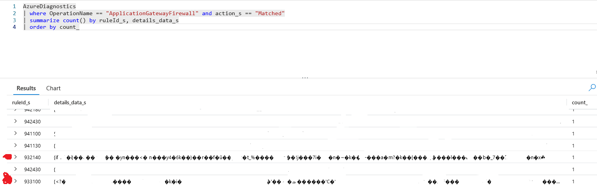
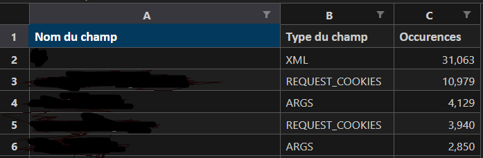
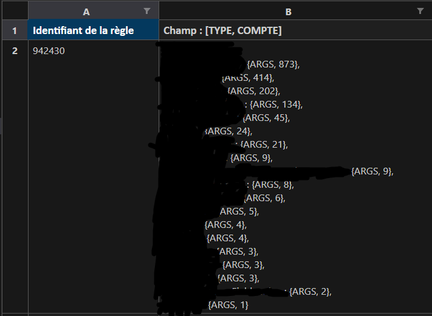
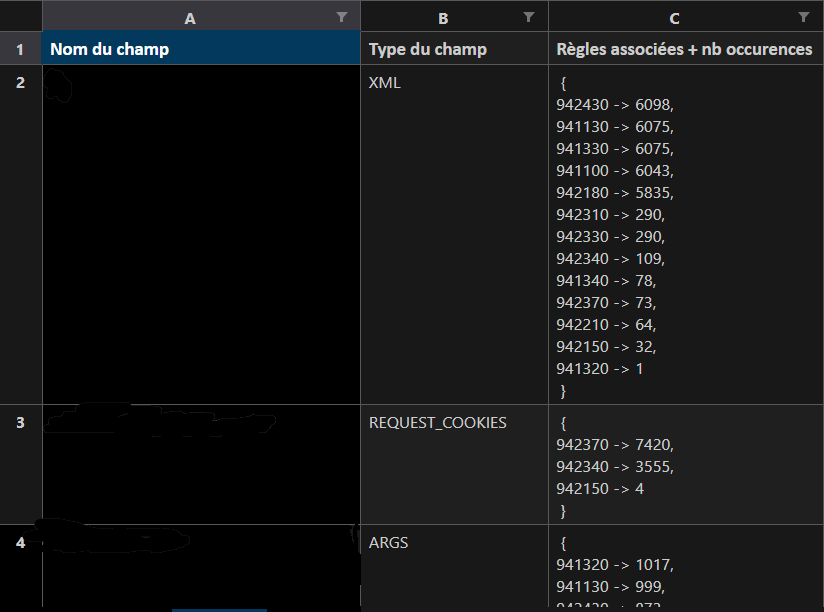
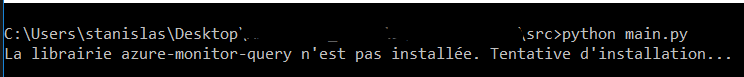
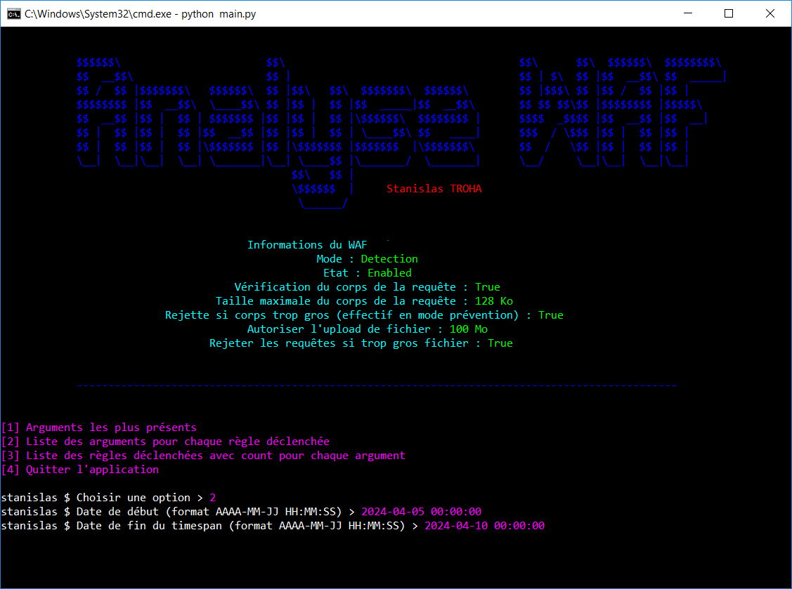
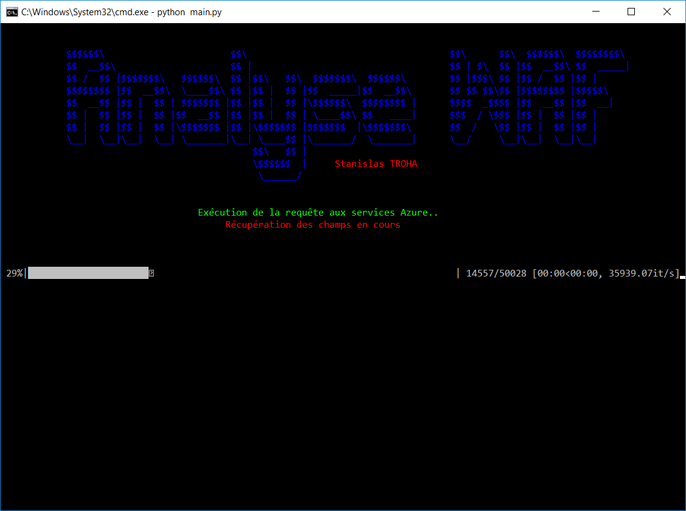
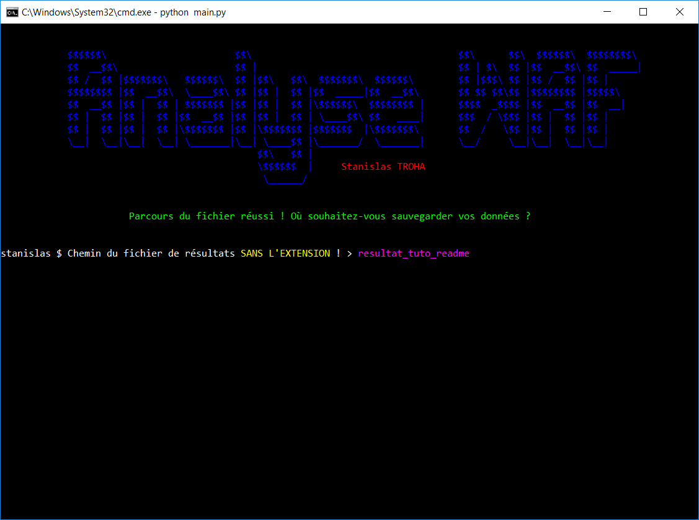
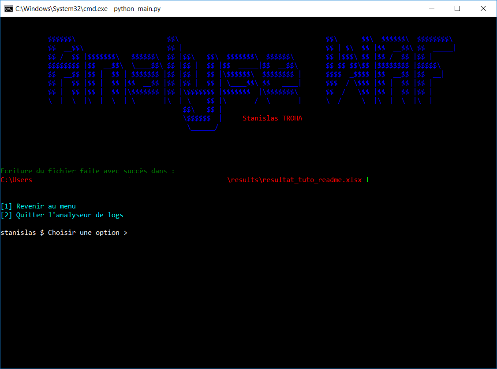
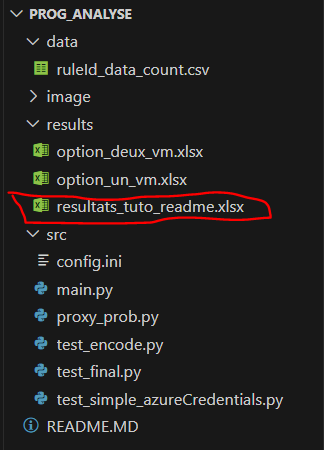

# Analyse logs WAF

Ce programme permet d'analyser et traiter les logs d'un WAF sur Azure. Initialement, le programme prenait en entrée un fichier csv qui comportait les résultats de la requête ci-dessous :

Voici la requête Azure qui vous permettait d'obtenir le fichier adéquat :

```
AzureDiagnostics
| where OperationName == "ApplicationGatewayFirewall" and action_s == "Matched"
| summarize count() by ruleId_s, details_data_s
| order by count_

```

Mais maintenant, le programme fait la requête directement auprès d'Azure via le SDK Python fourni, facilitant l'expérience utilisateur.  Etant donné que les données sont directement récupérées depuis Azure et ne transitent pas par un fichier csv, cela engendre une perte de données bien plus moindre. Cependant des données sont quand même illisibles car même depuis Azure Monitor, il y a des problèmes d'encodage. Ces données sont donc exclues du traitement par le programme. Voici un exemple :



On peut voir que deux lignes sont illisibles et donc intraitables.

La configuration des accès à Azure se fait dans la partie [Lancement et utilisation](#Lancement-et-utilisation).

Le programme fonctionne pour l'instant entièrement pour le mode détection d'un WAF (qui est recommandé si vous souhaitez analyser votre application). Au cas où vous ne connaissez pas la configuration de votre WAF, elle vous sera rappelée au lancement du programme.

# Options de traitement

Le programme possède trois options. Chacune permet de traiter et formater les données de différentes manières.

La première option affiche pour chaque champ présent dans les logs (donc champ problématique), le nombre d'enregistrements desquels il fait partie. C'est à dire, le nombre de fois que ce champ a levé une règle. Le type du champ est également précisé dans la deuxièe colonne (COOKIE, ARGUMENT, XML etc.).
Cela se présente comme suit :



La deuxième option permet pour chaque règle, de voir les champs y étant associés (les champs ayant donc déclenché la règle). Concernant les informations sur un champ associé à une règle, on retrouve le nom du champ, le type du champ, ainsi que le nombre d'occurences.
Cela se présente comme suit :



La troisième option quant à elle est un peu "l'inverse" de la deuxième. Pour chaque champ, on peut voir les différentes règles qu'il a levées, avec le nombre d'occurences pour chaque règle. Encore une fois, pour chaque champ, son type est également indiqué, afin de mieux comprendre ce qui peut lever des champs si vous n'avez pas connaissance de l'application qui fait les requêtes.
Cela se présente comme suit :



# Lancement et utilisation

### Avant de lancer :

Pour commencer, il vous faut configurer le fichier [config.ini](src/config.ini) en renseignant ces champs :

* AZURE_CLIENT_ID -> Identifiant de l'[application Microsoft Entra ID](learn.microsoft.com/fr-fr/entra/identity-platform/howto-create-service-principal-portal).
* AZURE_TENANT_ID -> Identifiant du tenant de l'application Microsoft Entra ID.
* AZURE_CLIENT_SECRET -> Secret de l'[application Microsoft Entra ID](learn.microsoft.com/fr-fr/entra/identity-platform/howto-create-service-principal-portal).
* ID_RESSOURCE -> Identifiant de l'Application Gateway auquel le WAF dont vous souhaitez les logs est relié. Vous pouvez trouver l'ID dans la section "Propriétés" de l'Application Gateway.

Il faut copier la valeur de ces champs directement après le signe "=" (éviter les espaces) pour éviter quelconque erreur d'interprétation par le lecteur du fichier.

### Lancement :

Pour démarrer le programme, ouvrir un invité de commande à la racine de là où [main.py](src/main.py) se trouve, c'est à dire dans [src/](src/).

Faire `python main.py` ou `python3 main.py` si vous êtes sous linux. Au lancement du programme, les dépendances s'installent automatiquement avec pip, il n'y a rien à faire.



Une fois qu'elles sont installées et que le fichier de configuration ne comporte pas d'erreurs, le menu apparaît :


Le programme propose 4 options. En tant qu'utilisateur vous devez entrer l'option choisie :

Vous pouvez soit utiliser une des trois premières options, soit la quatrième qui vous fera quitter le programme.

Une fois l'une des trois premières options choisie, il vous est demandé les dates de début et de fin à partir desquelles les logs seront récupérés puis traités. Le format à saisir pour renseigner ces deux champs vous est indiqué, donc impossible de se tromper..


Une fois les dates renseignées, le programme va les utiliser pour en déduire le timespan sur lequel récupérer les logs. Il va donc effectuer une requête aux services Azure pour récupérer les logs. Ensuite, il va commencer à les traiter :

Une fois le traitement effectué, il vous est demandé d'entrer le nom de votre fichier **sans l'extension** qui comportera les données formatées et analysées par le programme. Ce fichier de sortie se retrouvera alors dans le dossier [results/](results/).





On peut voir que le fichier est bien apparu dans le dossier [results/](results/) :



# Problèmes

### SSL Certificate

Il se peut que vous rencontriez un problème si vous essayez de lancer le programme en possèdant un proxy. Une erreur en lien avec la vérification du certificat SSL retourné par Azure aura lieu et la connexion à Azure ne pourra pas se faire, ainsi, l'analyse des logs est impossible car une requête à AzureMonitor s'avère impossible.

**Erreur de type :** `EnvironmentCredential: Authentication failed: [SSL: CERTIFICATE_VERIFY_FAILED] certificate verify failed: certificate has expired (_ssl.c:1006)`

Pour contourner ce problème, on peut ajouter une exception au proxy à cette URL :  
```py
https://management.azure.com/subscriptions/id_sub/resourceGroups/nom_resource_group/providers/Microsoft.Network/applicationGateways/id_app_gateway?api-version=REDACTED
```


### Environment Credntial

**Erreur de type :** `Attempted credentials: EnvironmentCredential: Authentication failed: AADSTS700016: Application with identifier 'YOUR_APPLICATION_ID' was not found in the directory 'YOUR_ORGANIZATION_ON_AZURE'. `   
Cette erreur est dûe à un CLIENT_ID qui n'est pas valide, ainsi, l'application n'est pas reconnue par les services Azure.

**Erreur de type :** `Attempted credentials: EnvironmentCredential: Authentication failed: Unable to get authority configuration for https://login.microsoftonline.com/AZURE_TENANT_ID. `  
Dans ce cas, alors c'est le TENANT_ID renseigné dans le [fichier de configuration](src/config.ini) qui est incorrect.

**Erreur de type :** `Attempted credentials: EnvironmentCredential: Authentication failed: AADSTS7000215: Invalid client secret provided. Ensure the secret being sent in the request is the client secret value, not the client secret ID, for a secret added to app 'AZURE_CLIENT_ID'.`  
Dans ce cas c'est le secret de l'application qui est incorrect, problème qui vient encore de la configuration du [fichier de configuration](src/config.ini).
